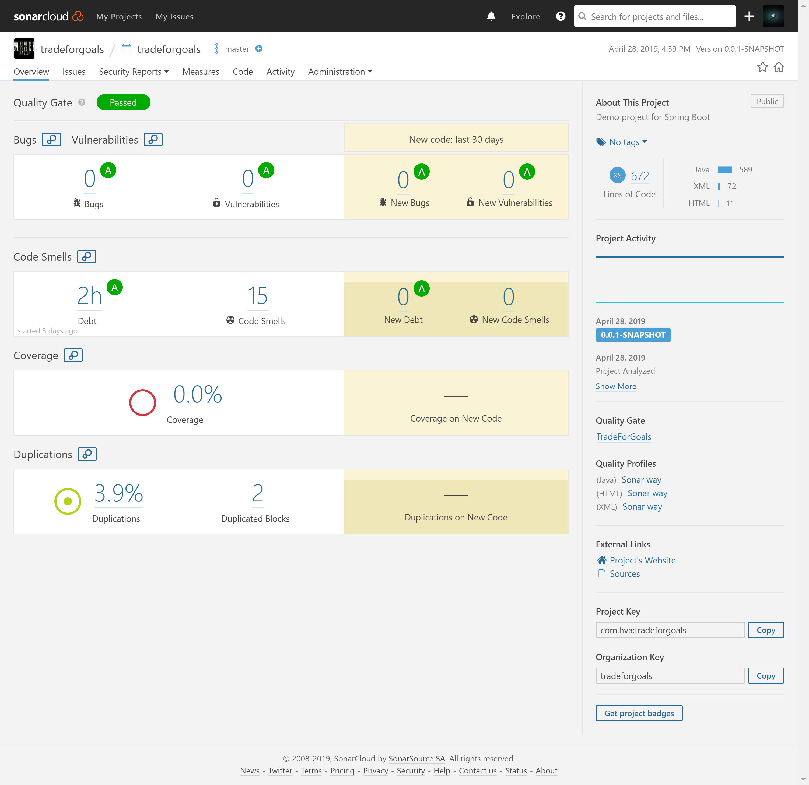
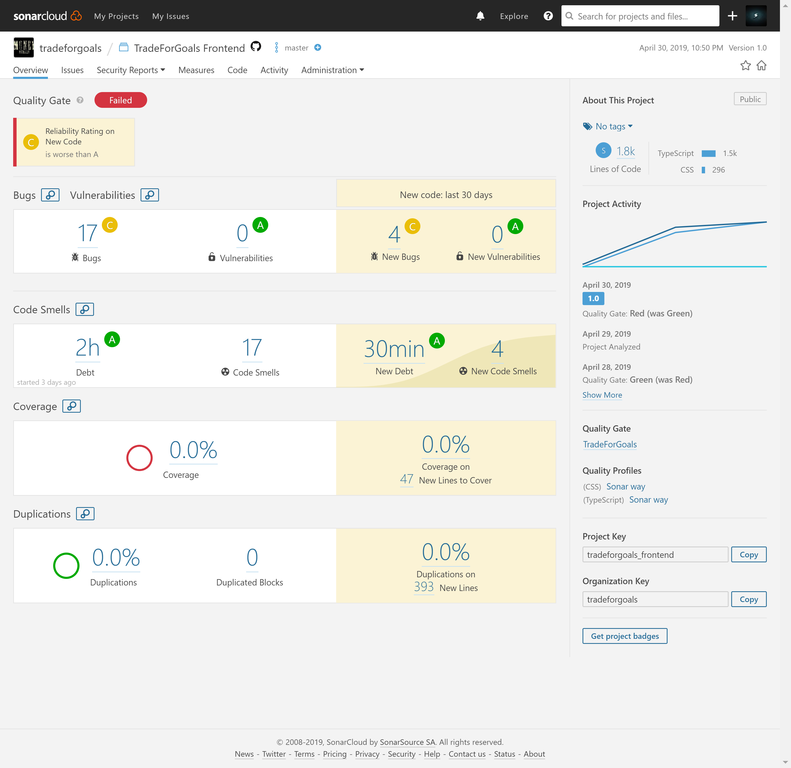
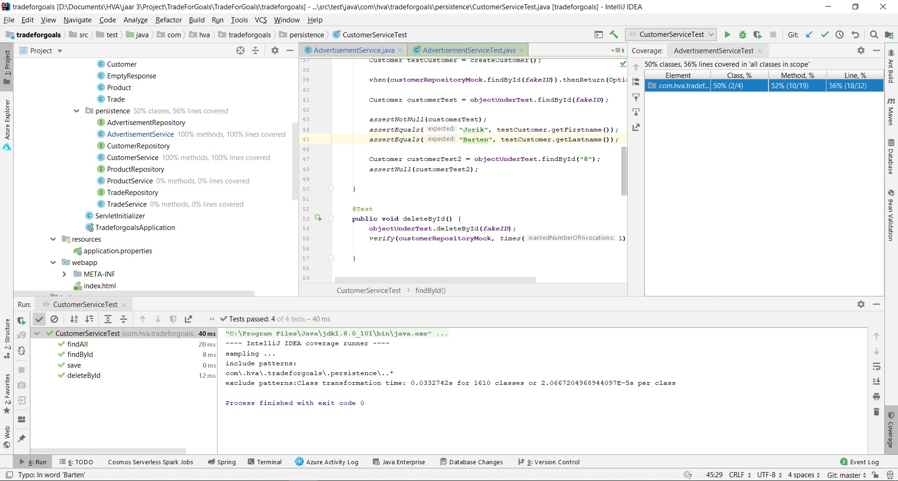
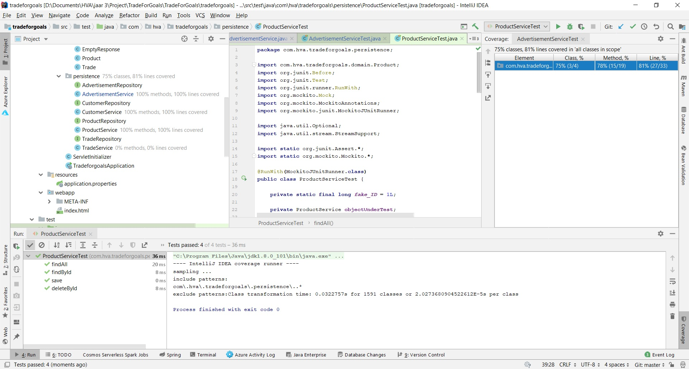
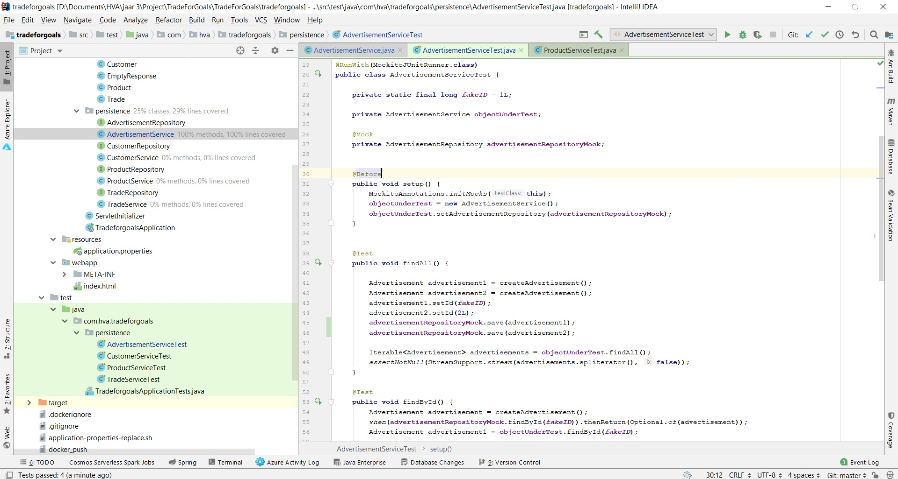
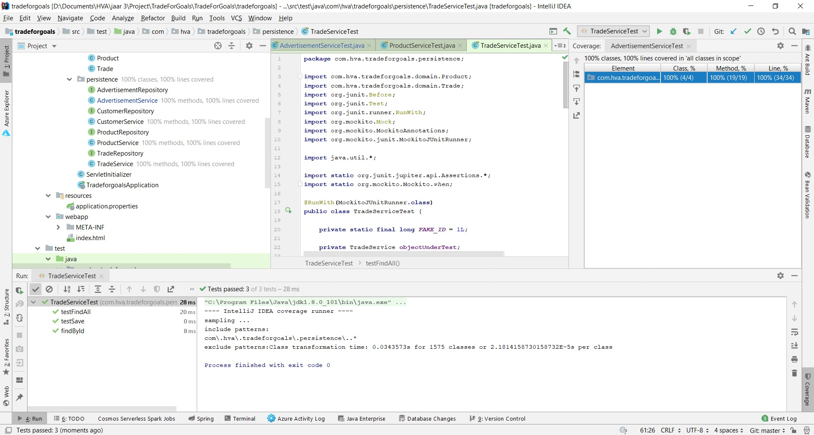
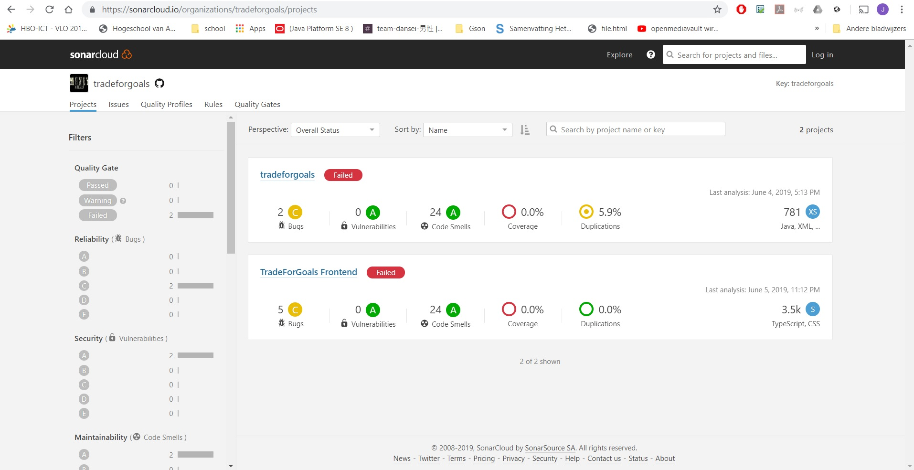
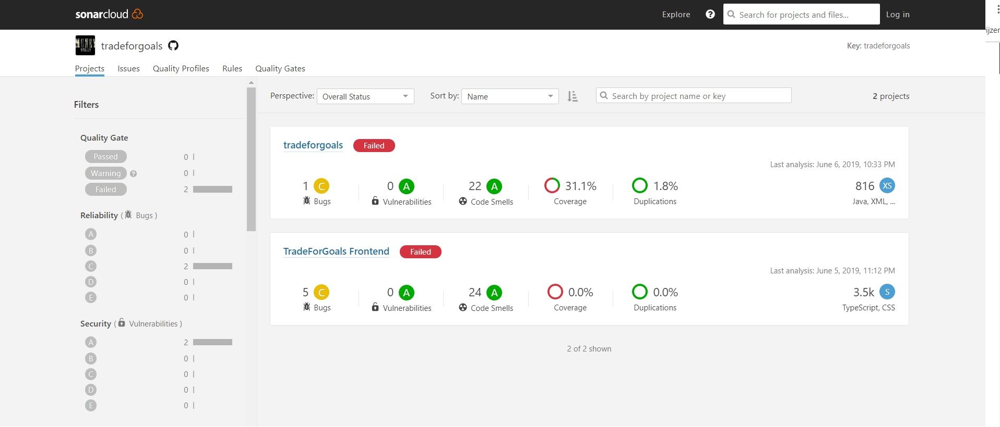

# Automated Software Validation 
> Jorik Barten - _500622155_  
> Simon van Zwoll - _500766699_  
> Thomas Jüsche - _500504300_  
> Marc Veens - _500758673_

## Opdracht 1: Ontdek nieuwe requirements
1. initiële proces
In het begin van het project hebben we voornamelijk gebrainstormd. Dit is een goede techniek om te achterhalen wat de requirements zijn voor een project. In  (Carrizo et al., 2014) wordt het achterhalen van van requirements ook wel elication genoemd.  Door het brainstormen hebben we goed de grote ruwe requirements kunnen opstellen.  Dit zijn alle belangrijkste requirements die het project moeten bevatten. Hierbij hebben we voornamelijk gekeken naar functionele requirements. Ook hebben besloten met welke ontwikkeltalen we het project gaan bouwen.
 We hebben de brainstormsessies gehouden met de projectleden. We zijn allemaal enthousiast en hebben aardige kennis van zaken. Hierdoor was het brainstormen op een acceptabel niveau. Volgens tabel 5 van (Carrizo et al., 2014) , scoren wij hierdoor goed op de "informant" factor.
Het probleem domein hebben we globaal vastgelegd, echter zijn we nooit echt in detail getreden. Hierdoor zijn de user stories niet heel geraffineerd. tabel 5 van (Carrizo et al., 2014) , wordt er onderscheid gemaakt tussen strategisch, tactisch , en basis probleemomschrijving. Ik denk dat we voornamelijk op strategisch en tactisch niveau nagedacht hebben.
We hebben in het begin van het project twee brainstormsessies gehouden. Dit is op zich geen verkeerde keuze, alleen moet je later in project een andere techniek gebruiken om je user stories verder uit te breiden. Dit hebben we helaas niet gedaan.
2. Welke techniek kunnen we nu het best toepassen.
Om het best te kunnen bepalen welke techniek we nu beste kunnen gebruiken, is het nodig om inzichtelijk te maken waar je staat in het ontwikkelproces, welke kwaliteiten de mensen hebben die requirements gaan achterhalen en wat de attributen zijn van je framework.
De frameworks die wij gebruiken zijn spring boot, hibernate en react. Daarnaast maken we gebruik van Travis CI en Sonar. 
React is een framework waar je een frontend voor een webapplicatie bouwt.
Springboot is een java framework waar wij een restfull api mee gaan bouwen.
Met hibernate managen we onze database.
Daarnaast gebruiken we Travis CI voor onze CI/CD pipe en Sonar om de kwaliteit van de code te waarborgen.
We in het midden van het proces. We hebben al redelijk wat werk gedaan en de CI/CD pipe en Sonar draaien al.
De projectleden zijn allemaal wel ervaren met een of meer van de frameworks die we gebruiken. Het probleem domein kennen wij ook redelijk, omdat het ons eigen project is. Hierdoor is het belangrijk dat een van ons de rol van productowner op zich neemt. We zijn alleen niet bekend met alle "elication" technieken.
In tabel van (Carrizo et al., 2014) Scoren wij goed op de scenario/ user stories. Het staat aangegeven dat dit een goede techniek is om te gebruiken als je midden in het project zit. Alle projectleden hebben hier ervaring met het maken van user stories. Ook de requirements die hieruit komen zullen geraffineerder zijn dan als je bijvoorbeeld gaat brainstormen.
Ook het feit dat we hiervoor apart van elkaar aan de slag kunnen is fijn voor ons. We hebben allemaal verschillende werkschema's en zien elkaar niet zo vaak. Hierdoor kunnen, we mits we van te voren afspraken maken wie welke processen beschrijft, apart van elkaar hieraan werken.
3. Het maken van user stories.
Iedereen krijgt de rol van Requirements Engineer. We zullen voor elk proces een Backend en Front-end user story maken. Hierdoor kan er beter inzichtelijk worden gemaakt wat er gedaan moet worden om een proces te kunnen realiseren. Daarna komen we bij elkaar, dit keer met de pet van product owner op, om te kijken of we met de user stories een product kunnen verschepen en waar we prioriteit aan moeten geven.
4. Verschil tussen Brainstormen en User stories
De ene techniek is niet beter dan de ander, echter is het wel belangrijk om te weten wanneer je de technieken kan inzetten.
Brainstormen is een goede techniek om in het begin te doen. Hiervoor moet je met een groep bijeen zijn. Hiermee kan je in grote lijn bepalen wat project nodig heeft.
Voor het maken van user stories moeten je al in grote lijnen bedacht hebben wat er nodig is. Daarna kan je met het bedenken van scenario's in detail bepalen wat het project nodig heeft. 
Door in het begin gebruik te maken van het brainstormen en nu user stories maken, hebben we de technieken op het juiste moment gebruikt.
5.  8 requirements
We hebben de volgende 8 requirements opgesteld. Dit doen we in de vorm van user stories
1.      Als gebruiker wil ik een account aanmaken.
-Front-end: Hiervoor willen we in de header de optie om een account aan te maken. Dit moet kunnen via email, facebook of google. Om dit veilig te kunnen doen zullen we hiervoor gebruik maken van firebase
-Backend : De gebruiker zal ook in de database moeten worden vastgelegd. Nadat de gebruiker is aangemaakt, zal deze worden opgeslagen in de database, het id van de de gebruiker zal het firebase token worden. 
2.      Als gebruiker wil ik een product opvoeren om te kunnen ruilen,
-Front-end: hiervoor moeten we navigeren na een aparte scherm, waar we een product kunnen toevoegen. De gebruiker moet een titel, een korte beschrijving en een foto mee kunnen geven.
- Backend: Deze gegevens moeten worden vastgelegd. Hiermee moet een duidelijk koppeling zijn tussen de gebruiker en het product.
3.      Als gebruiker wil ik een product ruilen.
-Front-end: als een gebruiker een product ziet moet hij kunnen aangeven dat hij deze wil ruilen tegen een van zijn producten. Dit zal binnen het scherm moeten gebeuren waar de gebruiker op dat moment zich bevindt. De gebruiker waarvan wordt gevraagd om mee te ruilen, moet de ruil kunnen accepteren of afwijzen. Op basis van deze keuze moet de eerste gebruiker een melding zien.
-Backend: De ruil moet worden vastgelegd met een status, open, geaccepteerd of afgewezen. Zodra de ruil wordt geaccepteerd moeten de producten van eigenaar gewisseld in de backend, daarnaast moet de status van ruil aangepast worden naar geaccepteerd. Als een ruil wordt afgewezen moet alleen de status van de ruil worden aangepast.
4.      Als gebruiker wil ik een product adverteren.
-Front-end: geadverteerde producten moeten zichtbaar zijn op de welkomstpagina, Als een gebruiker zijn producten inziet, moeten hierbij de optie zijn om deze te kunnen adverteren.
-Backend: De producten hebben een attribuut nodig om te kunnen zien of het huidige product geadverteerd word of niet.
5.      Als gebruiker wil ik een product in een categorie kunnen plaatsen.
-Front-end: Tijdens het opvoeren wil ik een product een categorie willen meegeven.
-Backend: De producten hebben een attribuut nodig om te kunnen zien in welke categorie dit product valt.

6.      Als gebruiker wil ik mijn ruil geschiedenis inzichtelijk willen maken.
-Front-end: Er moet een pagina komen waar de ruil geschiedenis van een gebruiker toonbaar is. Hier moet de gebruiker zien welke producten er zijn geruild.
-Backend: Er moet een endpoint komen waarbij de ruil geschiedenis van een gebruiker kan worden opgevraagd. Er moet ook een endpoint komen die alle producten teruggeeft op basis van de ruil geschiedenis van een gebruiker. Dit zijn alle producten die een gebruiker heeft en had.
7.      Als gebruiker wil ik producten zoeken.
- Front-end: Er moet een zoekbalk komen en een resultatenscherm. In het resultatenscherm hoeft alleen de foto en de titel van een product zichtbaar te zijn.
Er moet kunnen worden gezocht op titel en categorie Backend: Er moet een verschillende endpoints komen die producten teruggeeft op de hierboven genoemde zoekcriteria.
8.      Als gebruiker wil ik producten van een andere gebruiker inzien.
- Front-end: De gebruiker moet ook op gebruikers kunnen zoeken. Er moet dus een zoekcriterium bij komen.
-Backend: Er moet een nieuw endpoint komen die producten teruggeeft op basis van het id van een gebruiker (dit is niet het id van een product).
 
 
bron :
Carrizo, D., Dieste, O., & Juristo, N. (2014). Systematizing requirements elication technique selection. Elsevier.
 

## Opdracht 2: Nulmeting via SonarCloud
Backend:

Front-end:

## Opdracht 3: Ontwikkel unit testen
De backend is geschreven in Java en er wordt gebruikt gemaakt van het Spring framework. 
Om in de backend CRUD operaties uit te voeren maken wij gebruik van de CRUD repository. 
De CRUDrepository is een interface die gebruikt kan worden met een aantal vaste methodes.
In de services worden de methodes uit de repository uitgewerkt.

Een Unit test moet de functionaliteit van een class afzonderlijk kunnen testen.
Met de geimplementeerde repository is er binnen de services een afhankelijk gecreeerd.
Om deze afhankelijkheden na te bootsen gebruiken wij de library 'Mockito'.
Met Mockito kan je een 'Mock' maken van bijvoorbeeld de Spring repository om zo de functionaliteit van je class te kunnen testen.

Om de library te importeren door middel van dependecy injection zet je de volgende dependecy in je Pom.xml`

  <dependency>
        <groupId>org.mockito</groupId>
        <artifactId>mockito-all</artifactId>
        <version>1.10.19</version>
        <scope>test</scope>
   </dependency>
   
Het Unit testen doen wij met JUnit5.
Om de library te importeren door middel van dependecy injection zet je de volgende dependecy in je Pom.xml`

 <dependency>
     <groupId>org.junit.jupiter</groupId>
     <artifactId>junit-jupiter-api</artifactId>
     <version>RELEASE</version>
     <scope>test</scope>
 </dependency>

In de architectuur binnen de packages is een testmap aanwezig. Het path naar deze map is als volgt:
Project\TradeForGoals\TradeForGoals\tradeforgoals\src\test\java\com\hva\tradeforgoals\persistence

1. Maak de benodigde Unit testen aan.
2. Zorg dat de naam van je testclass eindigd op 'Test'.
3. Zorg dat de annotatie '@RunWith(MockitoJUnitRunner.class)' boven de public class staat.
4. Maak een instance aan van de class die je wilt testen. Het is gebruikelijk om deze class 'object under test' te noemen.
5. Creeer een 'mock' van de benodigde repository en zet hier de @Mock annotatie nodig.
6. Als de auto-import aan staat zal je zien dat de volgende imports gedaan zijn:
- import static org.mockito.Mockito.*;
- import org.mockito.Mock;
- import org.mockito.MockitoAnnotations;
- import org.mockito.junit.MockitoJUnitRunner; 
7. Creeer een public void setup met de @Before annotatie. 

In deze methode kan je aangeven welke instanties en repositories hij tot zijn beschikking moet hebben voor het uitvoeren van de test.
Dat ziet er bijvoorbeeld als volgt uit:

		MockitoAnnotations.initMocks(this);
        objectUnderTest = new CustomerService();
        objectUnderTest.setCustomerRepository(customerRepositoryMock); 
	

8. Zet boven elke methode die je wilt testen de annotatie @Test.
Als de auto-import aan staat zal je zien dat inmiddels ook de volgende imports gedaan zijn:

- import org.junit.Before;
- import org.junit.Test;
- import org.junit.runner.RunWith;

Het is handig om, wanneer je veel testdata moet aanmaken, een testobject aan te maken met de fields van de originele class.
In de CustomerService test wordt er bijvoorbeeld een methode aangeroepen die elke keer als dat nodig is een testcustomer aangemaakt.

Het is belangrijk om te testen om te kijken of de code werkt en beschermd is tegen bijvoorbeeld foutieve invoer.
In de methode findById() wil je bijvoorbeeld controleren of de juiste data inderdaad is gevonden.
Hierna wil je ook de inhoud van het gevonden object vergelijken met een verwachte waarde.

Onderaan je test kan je gebruik maken van methodes van Junit als 'assertNotNull' en 'assertEquels' om de verwachte waarde en exacte waarde met elkaar te vergelijken.
Wanneer je op de public testclass klikt en kiest voor 'run with coverage' zal de test laten zien hoeveel methodes er zijn aangeroepen.
Ook zal Junit laten zien hoeveel lines code van het objectUnderTest daadwerkeljk zijn getest.

Bij het pushen naar Git wordt er automatisch een nieuwe build gedaan zoals beschreven in opdracht 4.
Bij het inchecken in Sonar worden de testen automatisch opnieuw uitgevoerd.

###Screenshots:

CustomerService:

ProductService:

AdvertisementService:

TradeService:

### Resultaat code coverage Sonar

Before Unit tests:

After Unit tests:

Na het uploaden van de Unit tests voor de services binnen de back-end applicatie is de code-coverage met 31.1% toegenomen.

## Opdracht 4: Opzetten van een CI/CD pipeline
We hebben Travis CI gebruikt om de CI/CD pipeline op te zetten. De stappen voor de front-end zijn als volgt: 
1. Git trigger op de master branch naar Travis CI
2. Er wordt een `npm install` gedaan om alle packages te installeren
3. Er wordt een `tslint-reporter` gedraaid, zodat ook tslint foutmeldingen in SonarCloud naar voren komen. Dit gebeurt standaard niet.
4. `sonar-scanner` wordt uitgevoerd waarmee de kwaliteit van het hele front-end project wordt gecontrolleerd.
5. Er wordt een Docker container aangemaakt
    1. `npm install` binnen de container
    2. `npm run build-production`: er wordt een build gemaakt die voor productie bedoeld is.
    3. `npm run tslint`: er wordt gecheckt of er geen errors in de tslint voorkomen. Warnings worden weergegeven maar gaat de build niet op stuk.
    4. `npm run test`: alle testen van de front-end code worden uitgevoerd.
    5. `npm run run-server`: om de NodeJS server te draaien die de front-end serveert. 
6. Er wordt een rapport naar SonarCloud gestuurd van de kwaliteit van de code.
7. De Docker container wordt uitgerold naar een Azure Container Registry.
8. Een trigger van een Azure App Service wordt aangeroepen waardoor de nieuwe image wordt uitgerold naar de App Service die gekoppeld is aan het domein.
8. De pipeline is voltooid. 

Voor de backend is er een soortgelijke implementatie.
1. Git trigger op de master branch naar Travis CI
2. `sonar-scanner` wordt uitgevoerd waarmee de kwaliteit van het hele back-end project wordt gecontrolleerd.
3. Er wordt een Docker container aangemaakt
    1. `mvn -f pom.xml` er wordt een build gemaakt van het project
    2. Tomcat wordt opgestart waarmee de applicatie geserveerd wordt.
6. Er wordt een rapport naar SonarCloud gestuurd van de kwaliteit van de code.
7. De Docker container wordt uitgerold naar een Azure Container Registry.
8. Een trigger van een Azure App Service wordt aangeroepen waardoor de nieuwe image wordt uitgerold naar de App Service die gekoppeld is aan het domein.
8. De pipeline is voltooid. 

## Opdracht 5: Implementatie BDD
[?]
